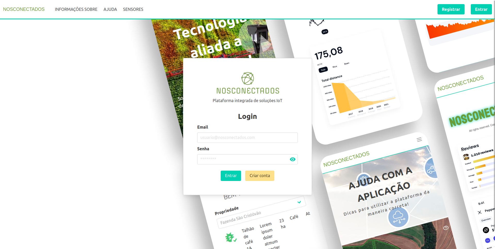
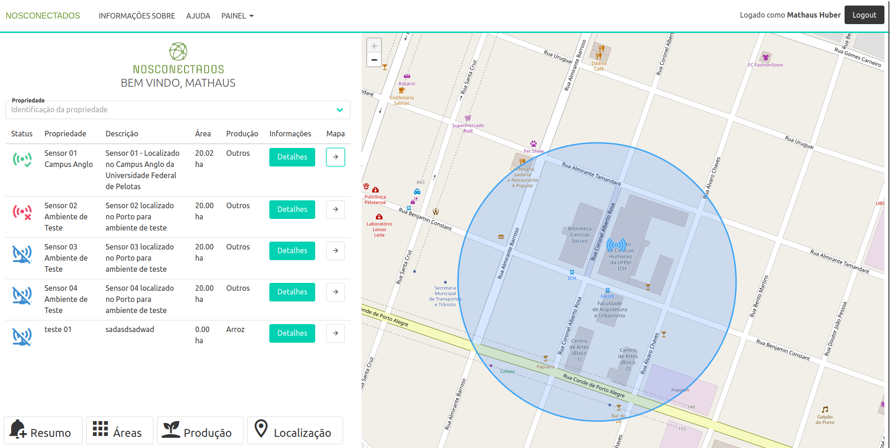
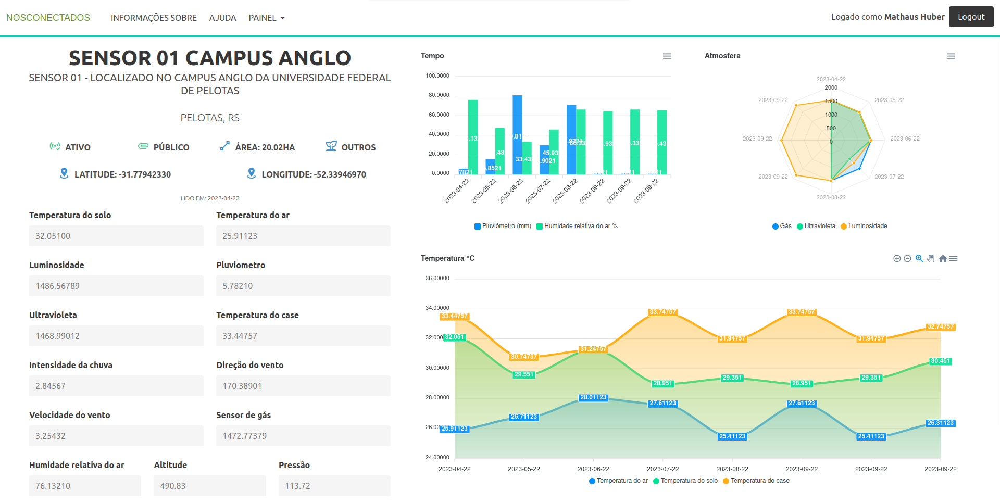

# NOSCONECTADOS Platform

## About Us

NOSCONECTADOS originated as an academic initiative at the Federal University of Pelotas (UFPel), supported by the National Council for Scientific and Technological Development (CNPq). Our primary goal is to foster technological development in the southern region of the state of Rio Grande do Sul, specifically in the city of Pelotas. Our focus is on the agricultural sector, and the platform was initially developed as a solution for integrated pest management.

## What the Platform Offers

### Decision-Making Power

Through a systematic analysis where information and data serve as the foundation for choices, professionals have a tool at their disposal to support daily decision-making. This enables a logical and organized analysis to determine the best course of action.

### Reliable Data

Utilizing information provided by Wireless Sensor Networks for the collection of various types of data, our platform ensures reliable information crucial for decision-making. We implement a security layer operating through protocols concerning the collected, processed, sent, stored, and analyzed data.

### Updated Reports

Access precise reports from any internet-enabled device, providing intuitive dashboards for a better understanding of data from the user's perspective.

## How to Use

To run the application, make sure you have the following versions installed:

- Node.js v16.0.0 (check with `node -v`)
- npm v7.10.0 (check with `npm -v`)

Follow these steps:

1. Install dependencies using either:
   - `npm install`
   - or `yarn`

2. Run the application:
   - Using npm: `npm run serve`
   - Using yarn: `yarn serve`

## External Article

Check out our [TCC Article](https://github.com/HuberM1998/TCC) for more in-depth information.

## Documentation

Explore our official documentation on [GitHub](https://github.com/HuberM1998/nosconectados).

## How to Contribute

If you would like to contribute to our project, please follow these steps:

1. Fork the repository.
2. Create a new branch for your feature or bug fix.
3. Make your changes and commit them.
4. Push to your fork and submit a pull request.

We appreciate your contributions!

---

## License

This project is licensed under the MIT License - see the [LICENSE](https://github.com/HuberM1998/nosconectados-frontend/blob/main/LICENSE.md) file for details.
